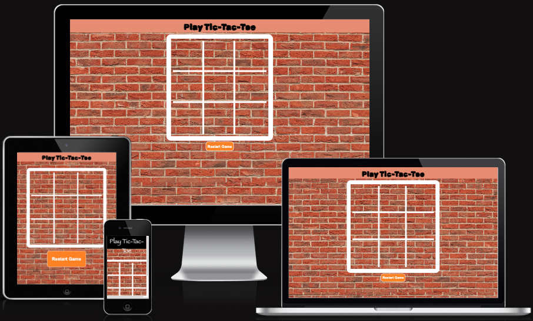

# JavaScript Tic-Tac-Toe Game

A simple Tic-Toe-Game made with Vanilla JS, where 2 Users can play together whilst receiving real-time Feedback.

[View Game on Github Pages](https://retr01234.github.io/js-tic-tac-toe/)

## CONTENTS

- [JavaScript Tic-Tac-Toe Website](#js-tic-tac-toe)
  - [CONTENTS](#contents)
  - [User Experience (UX)](#user-experience-ux)
    - [Initial Discussion](#initial-discussion)
      - [Key information for the site](#key-information-for-the-site)
    - [User Stories](#user-stories)
      - [Client Goals](#client-goals)
      - [First Time Visitor Goals](#first-time-visitor-goals)
      - [Returning Visitor Goals](#returning-visitor-goals)
      - [Frequent Visitor Goals](#frequent-visitor-goals)
  - [Design](#design)
    - [Colour Scheme](#colour-scheme)
    - [Typography](#typography)
    - [Imagery](#imagery)
    - [Features](#features)
    - [Accessibility](#accessibility)
  - [Technologies Used](#technologies-used)
    - [Languages Used](#languages-used)
    - [Frameworks, Libraries \& Programs Used](#frameworks-libraries--programs-used)
  - [Deployment \& Local Development](#deployment--local-development)
    - [Deployment](#deployment)
    - [Local Development](#local-development)
      - [How to Fork](#how-to-fork)
      - [How to Clone](#how-to-clone)
  - [Testing](#testing)
    - [W3C Validator](#w3c-validator)
    - [Manual Testing](#manual-testing)
      - [Testing User Stories](#testing-user-stories)
  - [Credits](#credits)
    - [Code Used](#code-used)
    - [Content](#content)
    - [Media](#media)
      - [Background Images](#background-images)
      - [Teams Images](#teams-images)
    - [Acknowledgments](#acknowledgments)

---

## User Experience (UX)

### Initial Discussion

To create a simple but cool yet interactive Tic Tac Toe Game that allows 2 Users to play on the same machine.

#### Key information for the site

- What is the purpose of the site/app?
- Can this game be played every Platform?
- How will I know if I won the game?

### User Stories

#### Client Goals

- To make the game Responsive for Mobile, Tablet and Desktop.
- To create a fun and immersive game for 2 people to play.
- To give users real-time feedback.

#### First Time Visitor Goals

- I want to give people the best first impression of the game.
- I want to be able to play it anywhere and anytime.

#### Returning Visitor Goals

- I want to get such good experience, so that I always play this game instead of all the other alternatives.

#### Frequent Visitor Goals

- I want to recommend this game to all my friends and family and enjoy the fun with them.

---

## Design

### Colour Scheme

This website uses a street wall type of theme, with red exposed brick and neat graffiti.

### Typography

The one and only font used for this website is 'fantasy'.

### Imagery

All images are taken from licence free stock photo website's which will be linked in the [credits](#Credits) section.

### Features

This website is a Single-Page Application that has only one page and 1 Main section.

- The page has:
  - A Header with a title to tell people what this game is and to add some structure to the site.
  - The Main Section which is the most important part and main focus of the website and that is: Tic Tac Toe Game-

### Accessibility

I paid good attention to detail to design by making it as easy to navigate as possible and keeping it straight to the point. This was done by:

- Using structured Semantic HTML
- There was good design and styling for such simple application
- Keeping all styles consistent throughout all Devices.

## Technologies Used

### Languages Used

- HTML
- CSS
- JavaScript

### Frameworks, Libraries & Programs Used

Git - Version control.

Github - To create and save my codebase.

SweetAlert - JavaScript Library to show better Browser Alerts.

[Favicon.io](https://favicon.io/favicon-generator/) For favicon.

[Am I Responsive?](http://ami.responsivedesign.is/) Website Display on all Devices

---

## Deployment & Local Development

### Deployment

Github Pages was used to deploy the live website. The instructions to achieve this are below:

1. Log in (or sign up) to Github.
2. Find the repository for this project: (https://github.com/Retr01234/js-tic-tac-toe) js-tic-tac-toe
3. Click on the Settings link.
4. Click on the Pages link in the left hand side navigation bar.
5. In the Source section, choose main from the drop down select branch menu. Select Root from the drop down select folder menu.
6. Click Save. Your live Github Pages site is now deployed at the URL shown.

### Local Development

#### How to Fork

To fork the js-tic-tac-toe repository:

1. Log in (or sign up) to Github.
2. Go to the repository for this project. (https://github.com/Retr01234/js-tic-tac-toe) js-tic-tac-toe
3. Click the Fork button in the top right corner.

#### How to Clone

To clone the Bully-Book-Club repository:

1. Log in (or sign up) to GitHub.
2. Go to the repository for this project. (https://github.com/Retr01234/js-tic-tac-toe) js-tic-tac-toe
3. Click on the code button, select whether you would like to clone with HTTPS, SSH or GitHub CLI and copy the link shown.
4. Open the terminal in your code editor and change the current working directory to the location you want to use for the cloned directory.
5. Type 'git clone' into the terminal and then paste the link you copied in step 3. Press enter.

---

## Testing

Testing was done constantly before and after pushing new changes to the master branch. However, during the production of this project, me and my Mentor were not able to find any REAL faults. Of course, there were some suggestions such as:

- Change the Font Style from 'Rubik Spray Paint' to something more easier to read.
- Use a JavaScript Library such as "Sweet Alert" to display better and faster Browser Alerts.

### W3C Validator

The W3C validator was used to validate the HTML on all pages of the website. It was also used to validate CSS in the style.css file.

- [Index Page HTML](/docs/index.jpg)
- [style.css CSS](/docs/css.jpg)

### JSHint - JavaScript Validator

- [sctipt.js JavaScript](/docs/js.jpg)

### Manual Testing

#### Testing User Stories

---

`First time Visitors`

| Goals                                                        | How are they achieved?                                                                                                      |
| :----------------------------------------------------------- | :-------------------------------------------------------------------------------------------------------------------------- |
| I want to give people the best first impression of the game. | By creating a simplistic and straight to the point application where the user can see instantly the purpose of the website. |
| I want to be able to play it anywhere and anytime.           | By making the Website fully responsive and accessible on all devices.                                                       |

`Returning Visitors`

| Goals                                                                                                      | How are they achieved?                                                                                                               |
| :--------------------------------------------------------------------------------------------------------- | :----------------------------------------------------------------------------------------------------------------------------------- |
| I want to get such good experience, so that I always play this game instead of all the other alternatives. | I made the design and user feedback, just different enough to give them a great impression and a long lasting "good feeling" effect. |

`Frequent Visitors`

| Goals                                                                                   | How are they achieved?                                                                                                           |
| :-------------------------------------------------------------------------------------- | :------------------------------------------------------------------------------------------------------------------------------- |
| I want to recommend this game to all my friends and family and enjoy the fun with them. | With the user friendliness and straight to the point design, users will want to recommend the app to their friends and families. |

---

---

### Full Testing

I tested my app fully on all Devices such as:

- Desktop:
  - Macbook Air M1 2021 14 inch screen.
  - Ultrawide LG 42 Inch Monitor
- Mobile Devices:
  - iPhone SE.
  - iPhone X
  - iPhone 12 Pro Max.
  - Samsung Galaxy S20 Ultra.
- Tablet Devices:
  - iPad Air Mini
  - iPad Pro

Each device tested the site using the following browsers:

- Google Chrome
- Safari
- Firefox

Additional testing was taken by me and by my Mentor on a variety of devices and screen sizes.

| Feature             | Expected Outcome                                                                                                                                   | Testing Performed                                        | Result                                                                                  | Pass/Fail |
| ------------------- | -------------------------------------------------------------------------------------------------------------------------------------------------- | -------------------------------------------------------- | --------------------------------------------------------------------------------------- | --------- |
| `Header`            |
| Main Page Title     | To Display the Title of the Site and stay consistent on all Devices.                                                                               | Viewed on every Device.                                  | Styling and Title was the same everywhere, just different sizes on the smaller devices. | Pass      |
| `Section`           |
| Box Clicks          | To start the game with a click on the box (First Letter is always "X")                                                                             | Clicked multiple times in all boxes.                     | Boxes always displayed "X" and then "O" (always in that order)                          | Pass      |
| User Alert          | As soon as it is the other players turn, a Browser Alert should be displayed.                                                                      | Clicked multiple times in all boxes.                     | Browser always displayed an Alert                                                       | Pass      |
| Winning Alert       | As soon as one player wins the game, the field will highlight the 3 Boxes that won the tic tac toe game.                                           | Got multiple winning combinations.                       | Field highlights the winning combination in a black background blinking animation.      | Pass      |
| Reset Functionality | As soon as one player wins the game, the field will highlight the 3 Boxes that won the tic tac toe game. And the game will be automatically reset. | Got multiple winning combinations. Game was reset again. | Game Field was reset to default with no "X" & "O"s.                                     | Pass      |
| Reset Button        | Game can be reset manually at all times with the click of the Reset Button.                                                                        | Clicked Button                                           | Game was reset to default.                                                              | Pass      |

---

## Credits

The idea for this project was fully my own decision but also with the inspiration of this YouTube Tutorial: (https://www.youtube.com/watch?v=DRaWr0Dcbl0)

### Code Used

- [SweetAlert] (https://sweetalert.js.org/)
- [CSS-Animation-Blinking] (https://webdevpuneet.com/css-animation-color-blinking/#gsc.tab=0)
- [SitePoint] (https://www.sitepoint.com/community/t/onclick-doesnt-work-unless-button-is-clicked-twice/339848)
- [W3Schools] (https://www.w3schools.com/howto/howto_js_remove_class.asp)
- [StackOverflow] (https://stackoverflow.com/questions/42224761/pointer-events-none-is-not-working)

### Content

Content for this Website was part of the 2nd Code Institute Project and purely made by me. - Pave (Retr01234)

### Media

#### Background Image

- [Brick-Background] (https://www.pexels.com/photo/brown-brick-wall-207142/)

### Acknowledgments

I would sincerely like to thank my Mentor Jubril Akolade for helping me get through this project.
